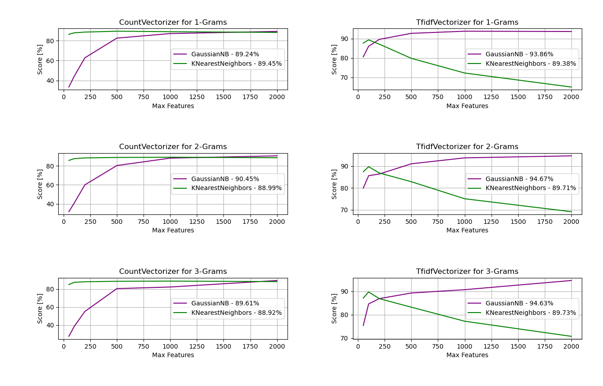

spam-filter
===========

Copyright (c) 2026 Politechnika Wrocławska

Email spam filter created for a university course, based on the following data:
https://github.com/stdlib-js/datasets-spam-assassin, licensed under "Open Data
Commons Public Domain Dedication & License 1.0.". Thank you stdlib-js.

Dependencies
------------

- beautifulsoup4
- narwhals
- scikit-learn

Results
-------

For GaussianNB and KNN classifiers, here are some results with different parameters
such as max_features and max_ngrams. Best score here is with the TF-IDF vectorizer,
GaussianNB classifier, 2000 features and 1-2 N-Gram range (94.67%). We got better
results with MLPClassifier (over 97%), but it was out of scope for this lab.

